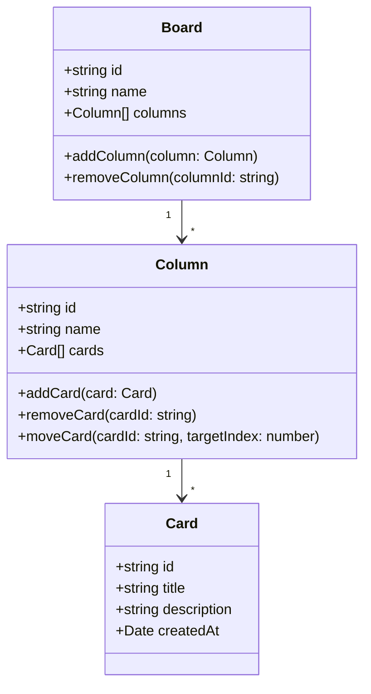

# Architecture Overview

## 1. Purpose

This document describes the architecture of the **Kanban Board Desktop Application**.  
The goal is to provide a clear understanding of:

- the main building blocks of the system  
- the domain model (Board, Column, Card)  
- how data flows through the app  
- how local storage is handled  
- how the design allows future extensions (e.g. AWS/DynamoDB sync)

This document is a living document and will be updated as the system evolves.

---

## 2. Scope

### 2.1 Current Implementation Status

✅ **Implemented:**
- Basic Electron + React + TypeScript + Vite setup
- Project structure with electron/, src/, and docs/ folders
- Electron main process with window management
- Preload script with context isolation
- React application entry point

📋 **Planned (not yet implemented):**
- Local, offline storage using LowDB (JSON file)
- Domain model classes: Board, Column, Card
- IPC handlers for data persistence
- Storage abstraction layer
- Kanban board UI components

### 2.2 Future Scope

Out of scope for now (planned for later):

- User accounts / authentication  
- Cloud synchronisation (e.g. AWS DynamoDB, AppSync, etc.)  
- Real-time collaboration  
- Multi-device sync

---

## 3. Technology Stack

- **Electron**  
  - Desktop shell and main process  
  - Manages application lifecycle and native APIs (file system, app paths, etc.)

- **React (with TypeScript)**  
  - Renderer process UI  
  - Component-based UI for the Kanban board

- **Vite**  
  - Development server and bundler for the React application  

- **LowDB**  
  - Lightweight JSON-based database for local persistence  
  - Used in the Electron main process to store boards, columns and cards

- **TypeScript**  
  - Type safety for domain models and application logic  
  - Encourages an object-oriented design

---

## 4. High-Level Architecture

### 4.1 Overview

The application is split into two main runtime parts:

1. **Electron Main Process**
   - Starts the application window
   - Manages the app lifecycle
   - Handles file system access and LowDB
   - Exposes a safe API to the renderer (via `preload.ts`)

2. **Renderer Process (React)**
   - Renders the UI (Kanban board, columns, cards, sidebar)
   - Handles user interactions
   - Calls the exposed API from the preload script to load and save data

The communication between these two parts happens over **IPC (inter-process communication)**, wrapped by the **preload script**, which exposes a **typed, restricted API** to the frontend.

### 4.2 Component Overview

**✅ Implemented:**

- `electron/main.ts`
  - ✅ Creates and manages the application window
  - ✅ Handles development and production modes
  - 📋 Initializes the LowDB database (planned)
  - 📋 Handles IPC requests for loading and saving boards (planned)

- `electron/preload.ts`
  - ✅ Runs in a special context with access to both Node and browser APIs
  - ✅ Sets up context isolation
  - 📋 Exposes a safe API to `window.api` (planned, currently uses `window.electronAPI`)

- `src/main.tsx`
  - ✅ Entry point for the React application
  - ✅ Renders `<App />` into the DOM

- `src/App.tsx`
  - ✅ Basic React component structure
  - 📋 Loads boards on startup (planned)
  - 📋 Renders current board, columns and cards (planned)

**📋 Planned (not yet implemented):**

- `src/models/*`
  - Domain model classes or types (Board, Column, Card)
  - Contain the core data structures and basic business logic

- `src/storage/*`
  - Abstractions for data access
  - In the future, can support multiple storage providers (local vs cloud)

---

## 5. Domain Model

📋 **Status: Planned (not yet implemented)**

The core domain model is centered around a **Kanban board** consisting of **columns** and **cards**.

### 5.1 Entities

#### Board

Represents one Kanban board (one project).

- `id: string`
- `name: string`
- `columns: Column[]`
- (later: `createdAt`, `updatedAt`, `archived`, etc.)

**Responsibility:**

- Owns the overall structure of the board
- Manages the list of columns
- Provides operations to add/remove/reorder columns

---

#### Column

Represents one column within a board (e.g. "To Do", "In Progress", "Done").

- `id: string`
- `name: string`
- `cards: Card[]`
- (later: `wipLimit`, `sortOrder`, etc.)

**Responsibility:**

- Groups related cards by status or workflow step
- Manages the list of cards in that column
- Provides operations to add/remove/reorder cards

---

#### Card

Represents a single task/item on the board.

- `id: string`
- `title: string`
- `description?: string`
- `createdAt: Date`
- (later: `priority`, `labels`, `dueDate`, etc.)

**Responsibility:**

- Holds the data for one task
- Does not know about columns or boards directly (to keep coupling low)

---

### 5.2 Relationships (UML-style)



---

## 6. Storage Architecture

📋 **Status: Planned (not yet implemented)**

### 6.1 Storage Abstraction

To keep the system flexible, data access will be abstracted via a storage provider interface.

**Planned interface:**

```ts
export interface StorageProvider {
  loadBoards(): Promise<Board[]>;
  saveBoards(boards: Board[]): Promise<void>;
}
```

This will allow multiple implementations:

- **LocalStorageProvider** (planned) – uses LowDB and JSON
- **CloudStorageProvider** (future) – uses AWS DynamoDB or another backend

The React UI will not know how data is stored; it will only call the provider.

### 6.2 Local Storage with LowDB (Planned Implementation)

**📋 Planned:** The Electron main process will use LowDB to read and write a JSON file on disk.

**Storage file path (example):**
- `~/Library/Application Support/KanbanBoard/data.json` (macOS)
- (The actual path is resolved via Electron's `app.getPath('userData')`.)

**Data structure in JSON:**

```json
{
  "boards": [
    {
      "id": "board-1",
      "name": "Personal Kanban",
      "columns": [
        {
          "id": "column-1",
          "name": "To Do",
          "cards": [
            {
              "id": "card-1",
              "title": "Implement card creation",
              "description": "Create new cards from the UI",
              "createdAt": "2025-12-02T10:00:00.000Z"
            }
          ]
        }
      ]
    }
  ]
}
```

**Planned IPC handlers:**

- `load-boards` → returns all boards from LowDB
- `save-boards` → writes updated boards back to LowDB

**Planned preload API (will be exposed as `window.api`):**

- `window.api.loadBoards(): Promise<Board[]>;`
- `window.api.saveBoards(boards: Board[]): Promise<void>;`

**Note:** Currently, the preload script uses `window.electronAPI` as a placeholder. This will be renamed to `window.api` when the storage functionality is implemented.

---

## 7. Data Flow

📋 **Status: Planned (not yet implemented)**

### 7.1 Loading Data (Planned)

1. User opens the application.
2. Electron main process initializes LowDB.
3. React app starts and calls `window.api.loadBoards()`.
4. Preload forwards the request via IPC to the main process.
5. Main process reads data from the JSON file via LowDB.
6. Data is returned to React and stored in the UI state (e.g. using a state manager).

### 7.2 Updating Data (Planned)

1. User creates/updates/moves/deletes a card or column in the UI.
2. React updates the local state (Board/Column/Card objects).
3. React calls `window.api.saveBoards(updatedBoards)`.
4. Preload forwards the data via IPC to the main process.
5. Main process saves the new state to the JSON file using LowDB.

---

## 8. Future Extensions

The architecture is intentionally designed to support future features without major refactoring:

- **Multiple storage providers**
  - e.g. CloudStorageProvider using AWS DynamoDB
  - sync strategies between local and cloud storage

- **User accounts and authentication**
  - e.g. AWS Cognito or another identity provider

- **Web version**
  - Reuse most of the React UI and domain model
  - Replace Electron-specific storage with a web-compatible storage layer (IndexedDB or HTTP API)

- **Advanced features**
  - Tags, priorities, due dates
  - Sprint views, burndown charts
  - Role-based access, shared boards

---

## 9. Summary

**Current State:**
- ✅ Basic project structure is set up with Electron + React + TypeScript + Vite
- ✅ Electron main process and preload script are configured
- ✅ React application entry point is implemented
- 📋 LowDB integration is planned but not yet implemented
- 📋 Domain models (Board, Column, Card) are planned but not yet implemented
- 📋 Storage abstraction layer is planned but not yet implemented

**Architecture Goals:**
- The system will be a desktop-only Kanban board built with Electron + React + TypeScript + LowDB.
- The core domain model will consist of Board, Column, and Card, with clear relationships and responsibilities.
- Data access will be abstracted via a StorageProvider interface, allowing future cloud integrations (e.g. AWS DynamoDB).
- Electron's main process will handle persistence using LowDB and expose a safe API to the React UI via a preload script.
- The architecture is designed to be simple, extendable and suitable as a training project for OOP, Scrum and later full-stack/cloud topics.

**Legend:**
- ✅ Implemented
- 📋 Planned (not yet implemented)
